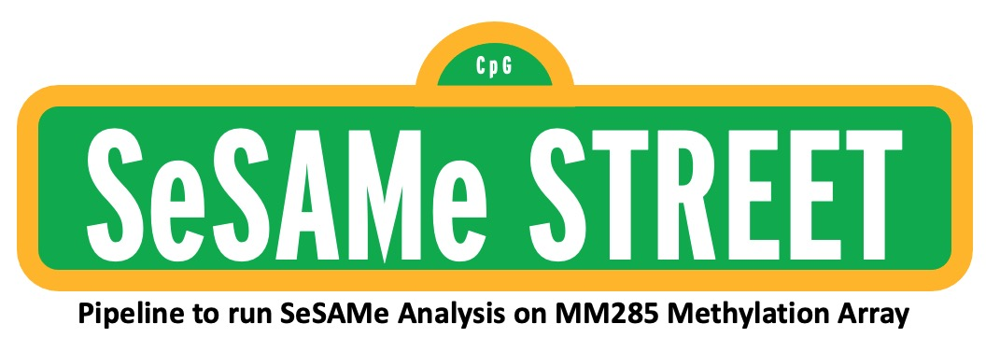

# SeSAMeStr

This pipeline is meant to act as a first pass analysis of DNA CpG Methylation using the SeSAMe R-Package.
This will take care of Quality Control, PCA, and Basic DML analysis. All files and plots will be output to 
output directory for ease of loading data back into R for either rerunning, replotting, or continuation of 
downstream analysis.

## Step 1: Install SeSAMeStr R-Package from Github

```
library(devtools)
devtools::install_github("Stefanos-Apostle/SeSAMeStr")
library(SeSAMeStr)
```

## Step 2: Fill out the SeSAMe_STREET_Sample_Sheet

Download from https://github.com/Stefanos-Apostle/SeSAMeStr/blob/main/SeSAMe_STREET_Sample_Sheet.xlsx


## Step 3: Create the Output directory Architecture

```
.
├── DML
│   ├── DMR_Analysis
│   ├── GO_Enrichment
│   ├── Heatmaps
│   ├── testEnrichments
│   └── Volcano_plots
├── PCA
└── QC
```

## Step 4: Run the SeSAMe_STREET() Function

```
SeSAMe_STREET(Idat_dir = "path_to/Idat_dir",
              out_dir = "path_to/output",
              sample_sheet = "path_to/SeSAMe_STREET_Sample_Sheet.xlsx",
              prep = "TQCDPB",
              formula = ~ Condition1 + Condition2 + ...,
              subsample = NA,
              cores = 4)
```
